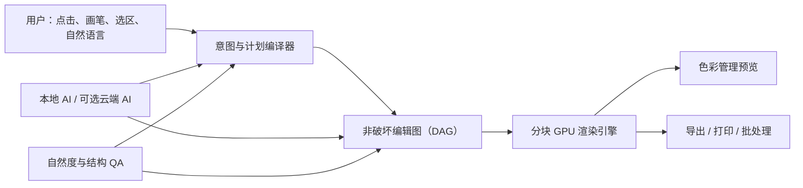

# Natural Photo Studio（自然光影）

> 工作名：Natural Photo Studio
> 当前阶段：M1 不可变编辑图与 CPU 参考渲染器已通过 Windows 本地门禁，公共 CI 待首次推送
> 产品定位：专业级、非破坏性、AI 原生的桌面照片编辑器

Natural Photo Studio 的目标不是做一个只能“套滤镜”的轻量工具，也不是把生成式模型包装成黑盒按钮。它要同时服务两种需求：

1. 普通用户可以通过“一键优化”或自然语言，在几秒内得到可靠、自然、可撤销的结果；
2. 摄影师与修图师可以进入专业工作区，检查蒙版、图层、曲线、颜色、局部结构和每一个 AI 决策。

所有自动操作最终都会被编译成可检查、可修改、可撤销的编辑步骤。原图默认只读，任何外貌变化、生成式内容和云端传输都有明确边界。

## 核心能力

- 人物照片精修：曝光、肤色、瑕疵、妆容、头发、衣物、背景与整体氛围；
- 风景照片精修：RAW、镜头校正、动态范围、去雾、局部光影、色彩分区和细节；
- 宠物照片精修：毛发边缘、眼睛、鼻子、毛色、背景分离和自然锐化；
- 智能替换天空：细枝/发丝级蒙版、地面反射、光向、色温和景深联动；
- 一键预览和套用预设：悬停预览、强度调节、肤色保护、批量一致性；
- 自然磨皮：消除不均匀而保留毛孔、细汗毛和人物年龄特征；
- 五官自然微调：自动建议与手动控制并存，限制幅度并保护身份特征；
- 移除路人或物品：先恢复结构线与阴影，再恢复纹理，检测重复图案和模糊斑；
- 自然语言编辑：支持“把天空换成日落，但人物肤色别变”之类的复合指令；
- 专业编辑基础：图层、蒙版、选区、混合模式、RAW、HDR、16/32 位、ICC/软打样、批处理；
- 非破坏式合成、重打光、景深、降噪、超分辨率、全景/HDR/焦点堆栈；
- 版本快照、差异对比、操作解释、质量检查和安全回滚。

## 产品形态



## 文档导航

| 文档 | 解决的问题 |
|---|---|
| [文档地图](docs/00-document-map.md) | 文档状态、阅读路径和决策优先级 |
| [产品愿景与边界](docs/01-product-vision-and-scope.md) | 为什么做、为谁做、什么不做 |
| [产品需求规格](docs/02-product-requirements.md) | 可追踪的功能需求与验收条件 |
| [交互与界面设计](docs/03-ux-interaction-design.md) | 快捷模式、专业模式和完整工作流 |
| [功能详细规格](docs/04-feature-specifications.md) | 人像、风景、宠物、换天、预设、移除等功能 |
| [自然语言编辑系统](docs/05-natural-language-editing.md) | 如何把描述安全地变成可撤销编辑 |
| [AI 与图像处理架构](docs/06-ai-image-pipeline.md) | 分割、深度、修复、重光照、模型路由与 QA |
| [系统架构](docs/07-system-architecture.md) | 桌面端、渲染、进程、GPU、存储和扩展体系 |
| [编辑文档与项目格式](docs/08-edit-document-model.md) | 图层 DAG、蒙版、缓存、撤销、`.nps` 文件 |
| [命令与插件契约](docs/09-command-and-plugin-contracts.md) | 命令协议、风险等级、幂等、插件边界 |
| [安全、隐私与伦理](docs/10-security-privacy-ethics.md) | 人像数据、云端 AI、审美修改和供应链安全 |
| [质量、性能与测试](docs/11-quality-performance-testing.md) | 性能预算、测试矩阵和发布门槛 |
| [项目目录结构](docs/12-project-structure.md) | 未来代码仓库的模块和所有权边界 |
| [实施路线图](docs/13-delivery-roadmap.md) | 从可运行原型到专业版的阶段、人员和退出条件 |
| [模型与数据治理](docs/14-model-data-governance.md) | 数据授权、模型卡、评测、灰度和回滚 |
| [发布与运维](docs/15-release-operations.md) | 安装、更新、崩溃恢复、遥测和支持 |
| [术语与开放问题](docs/16-glossary-open-questions.md) | 统一术语和需要在研发前确认的事项 |
| [M0 实现与验收记录](docs/17-milestone-m0.md) | 当前可运行范围、本地验证证据与已知限制 |
| [M1 范围与验收契约](docs/18-milestone-m1.md) | 不可变编辑 DAG、CPU 参考渲染、迁移与原子导出 |
| [M0 项目格式规范](specs/project-format/nps.project.v1.md) | 内容寻址对象、SQLite 元数据、恢复与完整性语义 |
| [M1 项目格式规范](specs/project-format/nps.project.v2.md) | 显式颜色契约、不可变编辑图和 v1→v2 迁移语义 |
| [M1 编辑图 Schema](specs/edit-graph/nps.edit-graph.v1.schema.json) | 版本化节点、引用、参数和严格结构边界 |

关键架构决定记录在 [docs/adr](docs/adr/) 中。

## 用户提出的八项需求覆盖

| 原始需求 | 主要设计位置 |
|---|---|
| 人物照片精修 | 02、03、04、06、11 |
| 风景照片精修 | 02、04、06 |
| 宠物照片精修 | 02、04、06 |
| 替换天空 | 04、06、09 |
| 一键预览和预设滤镜 | 03、04、08 |
| 人物磨皮 | 04、06、10、11 |
| 五官自动/手动微调且自然 | 03、04、06、10 |
| 清除路人/物品并自然填充 | 04、06、11 |

## 当前可运行范围

M0 已建立后续专业编辑能力所依赖的最小可信底座：

- 严格的 `nps.command/v1` 命令协议，未知字段和不支持的操作会被拒绝；
- 本地、非破坏的曝光调整，以及修订号、幂等重试、撤销、重做和分支历史；
- 16 位线性 RGB CPU 参考路径与确定性 PPM 编解码，供内核测试使用；
- SHA-256 内容寻址源对象、SQLite `STRICT` 元数据、WAL、完整性检查和异常关闭恢复；
- 同一项目的跨进程独占租约、原子创建发布和不覆盖已有项目；
- 默认拒绝网络与云推理的 M0 隐私策略；
- 合成像素测试、崩溃故障注入、公开仓库隐私扫描和跨平台 CI 配置。

M1 在此基础上增加了 FP32 预乘 RGBA、稳定颜色 ID、不可变编辑 DAG、曝光/曲线/
Mask16、ROI 与固定 512×512 tile、可取消的确定性 CPU 参考渲染、完整身份缓存隔离、
显式 `nps.project/v1 → v2` 迁移，以及绑定真实项目快照身份的原子 16 位 PPM 参考
导出。M1 仍在等待公共仓库三平台 CI 与 CodeQL 形成远端完成证据。

这不是可供终端用户修图的桌面应用。当前实现不包含 RAW/常见照片解码、GPU、完整
色彩管理、图层 UI、AI 模型或自然语言执行；PPM 仅是确定性测试格式。产品能力仍以
设计文档和路线图为准，后续里程碑逐项实现。

正式桌面版面向 Windows 与 Apple Silicon macOS：Windows 提供
`NaturalPhotoStudio.exe` 及签名安装包，macOS 提供签名并经 Apple 公证的
`.app`/`.dmg`。Linux 当前用于核心 CI 和开发验证，不属于 1.0 用户支持
范围。两端共享项目格式和编辑内核，平台差异集中在 GPU、系统集成、签名与
打包层；详见[发布与运维](docs/15-release-operations.md#21-桌面平台与交付物)。

## 构建与验证

前置要求：

- CMake 3.28 或更高版本；
- Ninja；
- 支持 C++23 的编译器；
- Git；
- Node.js 24 或更高版本与 npm；
- 固定到 `vcpkg.json` 中 `builtin-baseline` 的 vcpkg，放在 `.tools/vcpkg`。

获取固定版本的 vcpkg：

```bash
git clone --filter=blob:none --no-checkout https://github.com/microsoft/vcpkg.git .tools/vcpkg
git -C .tools/vcpkg fetch --depth 1 origin 40f3c709db80acf154ac4b17a1f83c564ebd022e
git -C .tools/vcpkg checkout --detach 40f3c709db80acf154ac4b17a1f83c564ebd022e
```

先运行 `.tools/vcpkg/bootstrap-vcpkg.sh -disableMetrics`；Windows 使用 `.tools\vcpkg\bootstrap-vcpkg.bat -disableMetrics`，并在已启用 x64 C++ 工具链的开发者终端中构建。随后运行：

```bash
cmake --preset dev
cmake --build --preset dev
ctest --preset dev
npm ci --ignore-scripts
npm run check:policy
```

Windows 上若 vcpkg 无法处理非 ASCII 的源码路径，请使用仅含 ASCII 字符的短检出路径；这不影响项目文件对 Unicode 路径的运行时测试。

生成一个只使用合成像素的演示项目：

```bash
./build/dev/nps-cli demo ./build/dev/demo.npsproj
./build/dev/nps-cli verify ./build/dev/demo.npsproj
./build/dev/nps-cli migrate-v1-v2 \
  ./build/dev/demo.npsproj ./build/dev/demo-v2.npsproj
./build/dev/nps-cli verify ./build/dev/demo-v2.npsproj
./build/dev/nps-cli export-demo \
  ./build/dev/demo-v2.npsproj ./build/dev/demo-v2.ppm
```

Windows 可执行文件名为 `nps-cli.exe`。演示项目和预览文件位于被忽略的构建目录，不应提交到版本库。

## 公共仓库隐私与安全边界

公开贡献只能使用代码生成数据，或放在 `tests/fixtures/public` 下且带有许可和来源
sidecar 的公开夹具。不要提交或附加个人/客户照片、项目目录、数据库、模型权重、绝对
用户路径、未脱敏日志、凭据或包含这些内容的压缩包。公开 issue 同样适用；安全漏洞请
使用仓库的
[Private vulnerability reporting](https://github.com/harveyxiacn/natural-photo-studio/security/advisories/new)。

提交前至少运行 `npm ci --ignore-scripts --no-audit --no-fund` 和
`npm run check:policy`。该门禁会检查 UTF-8/文档链接、公开文件类型与夹具来源、常见
凭据和个人路径、GitHub Action 固定、工作流危险权限以及 npm/vcpkg/Node.js/Gitleaks
版本一致性；远端 policy job 还会用经 SHA-256 校验的 Gitleaks 扫描当前工作树和可达
Git 历史。

扫描器只检查明确的仓库根，不会读取仓库上级目录，也不能把已经进入 Git 历史的私密
内容“自动匿名化”。如果误提交了私密内容，应立即停止发布，在公开前清理完整历史；
凭据还必须撤销并轮换，不能只在后续提交中删除文件。

把 CLI 暂存到独立前缀并从该位置运行：

```bash
cmake --preset release
cmake --build --preset release
cmake --install build/release --prefix ./build/stage
./build/stage/bin/nps-cli demo ./build/stage-smoke/demo.npsproj
./build/stage/bin/nps-cli verify ./build/stage-smoke/demo.npsproj
```

Windows 使用 `build\stage\bin\nps-cli.exe`。安装规则会把 vcpkg 提供且
`nps-cli` 所需的 OpenSSL Crypto 与 SQLite 运行时 DLL 放在同一 `bin`
目录；Linux/macOS 的当前默认 vcpkg triplet 静态链接这些依赖。许可与声明文件安装到
`share/natural-photo-studio`。这个目录只是用于开发和 CI 的 CLI 暂存树，
不是已签名的 Windows 安装器或 macOS `.app`，也不会由当前核心 CI 上传发布；
Windows 的 Visual C++ Runtime 等系统运行时仍是前置条件。

## 不可妥协的产品原则

1. 原图永不默认覆盖；
2. 自动结果必须能预览、解释、调弱和撤销；
3. “自然”优先于“变化明显”，皮肤保留纹理，五官保留身份；
4. 结构优先于纹理，移除对象不能只做一块模糊填充；
5. 本地优先，云端处理必须明确说明范围和目的；
6. 快捷操作与专业控制使用同一底层编辑模型，用户随时可以从一键结果继续精修；
7. 颜色、位深、元数据和导出不是附加功能，而是专业质量的一部分；
8. 不能达到可靠质量时，系统应给出候选与风险，而不是伪装成确定答案。
