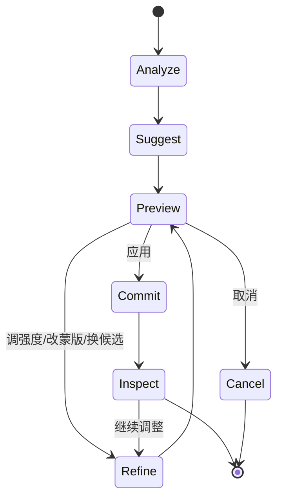
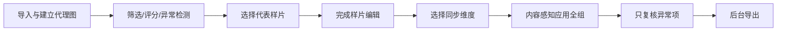

# 交互与界面设计

## 1. UX 目标

界面需要同时做到：

- 新用户不需要理解“频率分离、Alpha、DAG”也能完成照片；
- 专业用户能看到和修改所有决定；
- 自动处理不抢夺控制权；
- 高风险操作在应用前可比较；
- 鼠标、触控板、压感笔和键盘均可完成核心工作流；
- 多图、超大图和长任务期间仍能持续工作。

## 2. 信息架构

```text
首页
├─ 新建 / 导入
├─ 最近项目
├─ 任务模板
├─ 批量处理
├─ 预设与资源
└─ 教程

图库
├─ 文件夹 / 相册
├─ 评分、颜色标签和筛选
├─ 重复、模糊、闭眼和曝光异常建议
└─ 批量选择

编辑器
├─ 快捷模式
├─ 专业模式
├─ 自然语言
├─ 历史与版本
└─ 对比与 QA

资源中心
├─ 预设 / LUT
├─ 天空 / 背景 / 纹理
├─ 笔刷
└─ 工作流配方

导出中心
├─ 单张 / 批量
├─ 网络 / 社交媒体
├─ 印刷
└─ 水印与命名

设置
├─ 性能与缓存
├─ 色彩管理
├─ AI 与隐私
├─ 快捷键与无障碍
└─ 插件
```

## 3. 编辑器布局

```text
┌──────────────────────────────────────────────────────────────────────┐
│ 项目/保存状态 │ 快捷·专业 │ 撤销·重做 │ 对比 │ QA │ 缩放 │ 导出      │
├──────────────┬─────────────────────────────────────┬─────────────────┤
│ 任务与工具     │                                     │ 当前任务参数     │
│ AI 建议        │               图像画布              │ 图层与蒙版       │
│ 画笔/选区      │                                     │ 历史与版本       │
│               │                                     │ 直方图/示波器    │
├──────────────┴─────────────────────────────────────┴─────────────────┤
│ 自然语言：描述效果；可引用当前人物、选区或画布标记                  │
├──────────────────────────────────────────────────────────────────────┤
│ 胶片栏 │ 评分 │ 批量同步 │ 后台任务 │ 异常图片                     │
└──────────────────────────────────────────────────────────────────────┘
```

布局规则：

- 画布始终是视觉中心，面板可折叠、浮动或移动到第二屏；
- 左侧回答“做什么”，右侧回答“如何调整与验证”；
- 当前目标、蒙版、低置信度边缘和 AI 修改范围必须能叠加在画布上；
- 单图精修可隐藏胶片栏，多图任务保持胶片栏；
- 保存状态、后台任务和云端状态不能被面板遮住；
- 任意依赖悬停的功能都必须有点击或键盘替代入口。

## 4. 快捷模式

快捷模式按任务而不是专业术语组织：

- 一键优化；
- 人像精修；
- 风景增强；
- 宠物精修；
- 替换天空；
- 清除物体；
- 滤镜与风格；
- 裁剪与构图；
- 降噪与清晰；
- 自然语言编辑。

一张智能操作卡只显示必要信息：

1. 操作名称与目标；
2. 当前照片上的真实预览；
3. 推荐强度；
4. 保护对象（如人物、肤色、天空）；
5. 显示作用范围；
6. 换一个候选；
7. 进一步调整；
8. 重置。

系统分析后最多主动推荐五项。不能用大量红点和弹窗制造完成压力。

## 5. 专业模式

专业模式提供：

- 图层、组、调整层、蒙版、智能对象、剪贴蒙版和混合模式；
- 选区、通道、路径、边缘刷和语义区域；
- 曲线、色阶、HSL、色彩平衡、局部对比、色彩分级；
- 修复、仿制、Dodge & Burn、频率辅助；
- 透视、液化、网格变形和精确变换；
- 直方图、RGB/亮度示波、色域警告、软打样；
- 像素级、矢量路径、文字和形状基础能力；
- 节点解释、模型版本、缓存和 QA 状态。

快捷模式产生的结果在这里展开，例如：

```text
人像精修组
├─ 临时瑕疵修复（像素补丁层）
├─ 肤色均匀（调整节点 + 皮肤蒙版）
├─ 油光抑制（局部明暗）
├─ 皮肤平滑（频率感知节点）
├─ 纹理保护（保护蒙版）
└─ 人物曝光（曲线 + 人物蒙版）
```

专业模式创建的复杂操作回到快捷模式后显示为“自定义编辑”卡片，不丢参数、不栅格化。

## 6. 通用智能操作循环



提交规则：

- 曝光、色彩、预设等低风险操作：悬停预览，点击创建可撤销节点；
- 换天、移除、面部几何、生成式内容：先预览候选，点击“应用”才写入主分支；
- 批量操作：先展示代表样片和异常图片，确认后进入队列；
- 任何自动操作都不得在关闭预览时偷偷烘焙。

## 7. 对比与结果检查

支持五种对比：

- 按住 `\` 临时查看原图；
- 左右分屏；
- 拖动擦拭线；
- 原图 / 当前 / 候选网格；
- 版本 A / 版本 B。

对比必须锁定缩放、旋转和视点。人像、发丝、修复边缘可以打开同步的 100% 细节窗；缩略图负责检查整体自然度，100% 负责检查纹理与接缝。

QA 叠加层可显示：

- 过曝、欠曝和超色域；
- 蒙版低置信度；
- 重复纹理、断线和模糊斑；
- 人脸形变与背景弯曲；
- 皮肤纹理过度丢失；
- 换天边缘污染和光色冲突。

提示应允许忽略，但必须能定位到具体区域。

## 8. 人像交互

### 8.1 身份保持

人物面板顶部提供默认开启的“身份保持”。开启时：

- 自动五官位移使用保守上限；
- 不主动改变痣、雀斑、疤痕、种族特征和年龄特征；
- 不追求完全左右对称；
- 防止眼睛过大、下颌过窄、牙齿/眼白纯白；
- 大幅变化时自动从“直接应用”升级为“预览并确认”。

关闭时也不解除安全提示，只把更大范围的专业参数交给用户。

### 8.2 多人物

画布上以稳定人物标签显示“人物 1 / 人物 2”，用户可重命名为“新娘 / 新郎”。控制范围可选：

- 当前人物；
- 所有人；
- 主角完整处理，其他人轻度处理；
- 锁定人物，不接收批量修改。

儿童、老人、侧脸、遮挡脸和低分辨率脸不会机械复用同一模型强度。

### 8.3 磨皮

快捷档位：

- 轻微：临时瑕疵；
- 自然：肤色和明暗更均匀，纹理保留；
- 精致：商业/婚礼精修；
- 自定义：展开所有参数。

专业参数：

- 临时瑕疵；
- 平滑；
- 肤色均匀；
- 油光；
- 毛孔保护；
- 细纹保留；
- 黑眼圈；
- 局部明暗；
- 保护区域画笔；
- 纹理恢复画笔。

100% 以上缩放时可以打开“纹理检查”。系统检测到塑料感时提示并给出一键调弱，不强制覆盖用户决定。

### 8.4 五官

自动模式只给轻度建议；专业模式提供：

- 可见关键点和原始轮廓幽灵线；
- 单个控制点拖拽与数值输入；
- 左右联动/解除联动；
- 面部网格和冻结区域；
- 当前人物限定；
- 单部位重置；
- 局部液化与背景保护；
- “弱 / 建议 / 强”候选。

侧脸、强遮挡或模型置信度不足时自动建议会跳过，并打开手动辅助。

## 9. 预设交互

预设缩略图必须基于当前照片生成，不用通用宣传图代替。

- 鼠标悬停、键盘聚焦或触控长按显示预览；
- 支持接触表一次比较 4–12 个预设；
- 静态 LUT 与内容感知配方使用不同标识；
- 强度滑杆默认作用于整套配方，但可展开调整内部节点；
- 可选“保护肤色、保护天空、仅背景、仅人物”；
- 警告高光溢出、肤色异常和超色域；
- 预设可以收藏、搜索、版本化、导入/导出；
- 批量应用时重新计算每张照片的语义蒙版和曝光补偿。

## 10. 自然语言入口

入口包括：

- 底部常驻输入框；
- `Ctrl/Cmd + K` 命令面板；
- 画布框选后直接输入；
- 对象右键“用语言编辑”；
- 可选语音输入。

执行前显示结构化理解：

```text
对象：右后方红衣人物
操作：移除
附属区域：影子
保护：主角、黄色道路标线
输出：3 个候选
处理：本地优先
```

每个字段可点击修改。多个目标或低置信度时，在画布标 `A/B/C` 让用户选择；“高级一点”等主观描述转换为 2–3 个有名称的方向。

## 11. 批处理



同步维度必须独立选择：基础色彩、裁剪、预设、人像、瑕疵、天空、局部蒙版。固定参数可以复制；人物、宠物和天空蒙版必须逐张重算。

异常队列包括：

- 无法识别主体；
- 人脸遮挡或闭眼；
- 曝光/白平衡与样片显著不同；
- 蒙版溢出；
- AI 置信度低；
- 结果触发自然度或结构 QA。

## 12. 历史与错误恢复

- 历史以用户任务命名，而不是显示几十个内部算子；
- 每个高层任务可展开查看子节点；
- 支持命名快照和分支，如“自然版 / 商业版 / 黑白版”；
- 长任务可取消、暂停、后台继续；
- GPU 显存不足自动降为分块或 CPU，并说明性能影响；
- 模型不可用时保留手动工具和经典算法；
- 源素材移动后进入“重新链接”，不清空编辑；
- 同名导出默认生成版本，不静默覆盖；
- 崩溃后只恢复完整事务。

错误文案必须包含“发生了什么、结果是否已修改、下一步是什么”。例如：

> 未能可靠识别天空，已打开手动补选；原图和现有编辑未被修改。

## 13. 快捷键

| 操作 | Windows / Linux | macOS |
|---|---|---|
| 自然语言命令 | `Ctrl+K` | `Cmd+K` |
| 撤销 / 重做 | `Ctrl+Z` / `Ctrl+Shift+Z` | `Cmd+Z` / `Cmd+Shift+Z` |
| 应用 / 取消预览 | `Enter` / `Esc` | `Enter` / `Esc` |
| 临时看原图 | `\` | `\` |
| 分屏对比 | `Y` | `Y` |
| 隐藏面板 | `Tab` | `Tab` |
| 画笔 / 修复 / 仿制 | `B` / `J` / `S` | 同左 |
| 对象选择 / 套索 | `W` / `L` | 同左 |
| 平移 | 按住 `Space` | 按住 `Space` |
| 笔刷大小 | `[` / `]` | 同左 |
| 笔刷硬度 | `Shift+[` / `Shift+]` | 同左 |
| 快捷 / 专业模式 | `Ctrl+1` / `Ctrl+2` | `Cmd+1` / `Cmd+2` |

输入框聚焦时禁用单字母工具快捷键。所有快捷键可修改并检查冲突。

## 14. 无障碍与国际化

目标为 WCAG 2.2 AA，并补充图像编辑特有要求：

- 全功能键盘导航、明显焦点和屏幕阅读器标签；
- 状态不只依赖颜色，蒙版可组合颜色、轮廓和纹理；
- 可自定义蒙版颜色和透明度；
- 红绿、蓝黄和全色弱模拟；
- UI 100%–200% 缩放不遮挡主操作；
- 高对比主题、大控制点、减少动画；
- 所有拖拽参数都有数值输入；
- 面部控制点可通过列表选择和键盘微调；
- 画布对象有文字描述，如“右后方红衣人物”；
- 中文、英文文本布局和快捷键说明同步测试。

## 15. 首次引导

首次启动只询问：

1. 主要编辑人物、风景、宠物还是综合；
2. 默认快捷模式还是专业模式；
3. 是否允许云端 AI（默认“每次询问”）。

随后通过一次真实任务演示：导入 → 悬停预览 → 一句自然语言 → 展开图层 → 撤销/恢复 → 导出。高级功能在首次触达时提示，不连续弹出教程。

## 16. UX 验收

- 两种模式切换时像素和编辑数据完全一致；
- 每个 AI 结果都能显示区域、调弱和单独撤销；
- 多对象歧义不会静默选择错误对象；
- 高影响编辑在应用前有候选预览；
- 预设在当前图像上预览，而不是使用演示图；
- 键盘用户可完成导入、编辑、比较、撤销和导出；
- 网络中断、模型失败和显存不足不会丢失编辑；
- 批量任务会隔离异常图片；
- 原图在所有正常流程中不会被覆盖。
