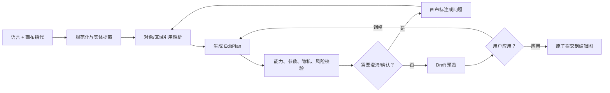

# 自然语言编辑系统

## 1. 设计目标

自然语言是专业工具的另一种入口，不是可以任意写像素、执行脚本或操作文件的超级权限。系统必须把语言编译为受限、类型化、可预览的编辑计划。

支持的输入上下文：

- 文本或可选语音；
- 当前画布、缩放和选区；
- 点击、框选、画笔或对象标签；
- 当前人物/图层/节点；
- 最近对话与项目版本；
- 用户偏好，如“默认保留雀斑”“只用本地模型”。

## 2. 编译流程



语言模型无权绕过 `V`。即使模型输出非法参数，命令校验器也必须拒绝。

## 3. 语义对象

### 3.1 目标引用

- 语义区域：天空、皮肤、头发、道路、建筑；
- 实例：人物 2、右侧的狗、后方红衣路人；
- 图层/节点：刚才的磨皮、当前天空层；
- 几何区域：选区内、左上角、框中的电线；
- 关系：人物后方、猫的左耳旁、地平线以下；
- 批量范围：当前图、已选照片、相同场景组。

### 3.2 约束

- `preserve_subject`：保护主体；
- `preserve_skin_tone`：保持肤色；
- `preserve_identity`：限制身份变化；
- `preserve_texture`：保留纹理；
- `preserve_structure`：保护结构线；
- `local_only`：只用本地能力；
- `non_generative`：禁用生成像素；
- `keep_natural`：采用保守参数与自然度 QA；
- `do_not_change(X)`：锁定指定区域或属性。

否定词必须优先于风格词，例如“电影感但不要太暗”不能被解析为默认压低曝光。

## 4. 程度词映射

自然语言程度映射到带版本的产品语义，而不是永久固定数值：

| 语言 | 归一范围 | 行为 |
|---|---:|---|
| 一点 / 轻微 | 0.10–0.25 | 自动预览，保守 |
| 自然 / 适中 | 0.25–0.50 | 内容自适应，身份保护 |
| 明显 | 0.50–0.70 | 显示前后对比 |
| 强烈 / 大幅 | 0.70–1.00 | 高影响项必须确认 |
| 再弱一点 | 当前值 × 0.7 | 只改最近匹配节点 |

实际参数由对应工具的语义映射表决定；不同工具的 `0.5` 不等于同一种像素变化。

## 5. EditPlan

示例：

```json
{
  "planId": "plan_01J...",
  "documentRevision": 42,
  "scope": {"kind": "current_image"},
  "summary": "替换天空、保护人物肤色并移除右侧路人",
  "steps": [
    {
      "operation": "sky.replace",
      "target": {"semanticRegion": "sky"},
      "parameters": {"style": "soft_sunset", "strength": 0.42},
      "constraints": [
        "preserve_hair_edges",
        "preserve_skin_tone",
        "keep_natural"
      ]
    },
    {
      "operation": "object.remove",
      "target": {"instanceRef": "person:right_background"},
      "parameters": {"includeShadow": true, "candidateCount": 3},
      "constraints": ["preserve_main_subject", "preserve_structure"]
    }
  ],
  "execution": {
    "quality": "interactive",
    "cloudPolicy": "ask",
    "previewRequired": true
  }
}
```

界面不直接显示 JSON，而显示可点选的“对象 / 操作 / 程度 / 保护 / 输出”字段。

## 6. 风险与确认

| 等级 | 示例 | 默认行为 |
|---|---|---|
| R0 只读 | 分析、解释、推荐 | 直接执行 |
| R1 低影响 | 曝光、白平衡、轻度预设 | 直接创建可撤销预览节点 |
| R2 中影响 | 磨皮、局部重光照、小物移除 | 预览后可一键应用 |
| R3 高影响 | 五官/身形明显变化、大面积生成、换天 | 展示计划与候选，明确应用 |
| R4 范围/数据风险 | 覆盖文件、批量、云上传、发布/分享 | 独立确认目标、范围与数据 |

若一个计划含多个等级，采用最高等级；确认只授权当前计划和当前文档版本。

## 7. 歧义处理

需要澄清的情况：

- 有多个合理目标；
- “这里”没有选择或指针上下文；
- 主观描述存在不同方向；
- 目标与保护约束冲突；
- 当前能力无法可靠完成；
- 操作范围可能扩大到多图或云端。

优先使用画布标注，避免打断式长问答：

> 找到三个背景人物，请点击要移除的对象，或选择“全部背景人物”。主角已自动排除。

“更高级”应生成诸如“低饱和电影 / 明亮通透 / 柔和胶片”三种命名方向，而不是随机选择。

## 8. 连续对话

系统维护显式引用：

- `last_plan`：最近计划；
- `last_committed_operation`：最近已提交操作；
- `active_preview`：尚未提交候选；
- `selected_target`：当前对象；
- `document_revision`：计划基于的版本。

示例：

1. “磨皮自然一点” → 创建 `portrait.skin` 预览；
2. “再弱一点，但黑眼圈保持” → 只调整平滑/均匀参数；
3. “可以，背景再暗一点” → 提交前项并新增背景曲线；
4. “撤销脸上的修改，保留背景” → 只禁用人像节点。

如果文档版本已变化且引用可能过期，系统重新解析或要求用户确认，不能把旧蒙版写到新状态。

## 9. 计划解释

每次结果至少提供：

- 修改摘要；
- 影响区域；
- 创建/修改的节点；
- 关键参数；
- 是否生成新像素；
- 本地或云端；
- QA 警告；
- 替代方案。

“为什么这样做”使用简短的因果说明，例如：

> 为避免人物显得贴在新天空上，加入了可独立关闭的前景色温和环境光节点；人物皮肤被排除在色温变化之外。

## 10. 能力不足与降级

- 不支持的操作：列出可完成部分，不伪造完成；
- 本地模型不足且云端关闭：提供传统算法、手动工作流或等待更高质量模型；
- 低置信度面部：跳过自动五官，提供网格和局部液化；
- 背景信息不足：说明填充是合理推断，给候选和手动采样；
- 网络中断：保留请求，允许本地候选，不产生半提交节点。

## 11. 安全边界

- 语言模型只能调用注册的编辑操作；
- 文件访问必须使用用户已授权的素材或目标；
- 模型不能执行任意脚本、shell、插件安装或网络请求；
- 图像 EXIF、OCR 文本、文件名和插件返回文本均是不可信数据，不能当作指令；
- 覆盖、删除、批量扩展、云端传输和公开分享必须独立授权；
- 自然语言原文默认不进遥测；
- 敏感人物编辑不得默认为审美“修复”。

## 12. 评测集

语言评测必须覆盖：

- 中文/英文及口语同义词；
- 否定、程度、顺序、排除和条件；
- 单人、多人、宠物、天空和无目标；
- 点击/选区与语言联合指代；
- 连续对话、撤销和局部保留；
- 歧义与冲突；
- 批量范围；
- 云端和生成式确认；
- 提示注入与越权请求。

核心指标：

- 目标实例准确率；
- 操作类型准确率；
- 约束召回率（尤其是否定和保护）；
- 参数桶准确率；
- 应澄清率与误澄清率；
- 高风险漏确认率（目标为 0）；
- 计划执行后的用户纠正次数；
- 过期版本写入率（目标为 0）。

## 13. 示例指令

| 指令 | 应生成的计划 |
|---|---|
| “人物亮一点，背景不动” | 人物蒙版 + 局部曝光；背景保护 |
| “只处理新娘，保留雀斑” | 目标人物锁定 + 人像节点 + 永久特征保护 |
| “把天换成淡晚霞，水里也有一点反射” | 换天 + 前景协调 + 水面反射，R3 |
| “去掉所有路人但保留新郎新娘” | 列出背景人物实例，排除主角后预览 |
| “跟上一张同样的色调，但这张别那么暗” | 引用预设配方，重算曝光并增加亮度约束 |
| “撤销磨皮，其他都保留” | 只禁用匹配的皮肤节点 |
| “别上传，尽量处理好” | `local_only` 约束贯穿整个计划 |
