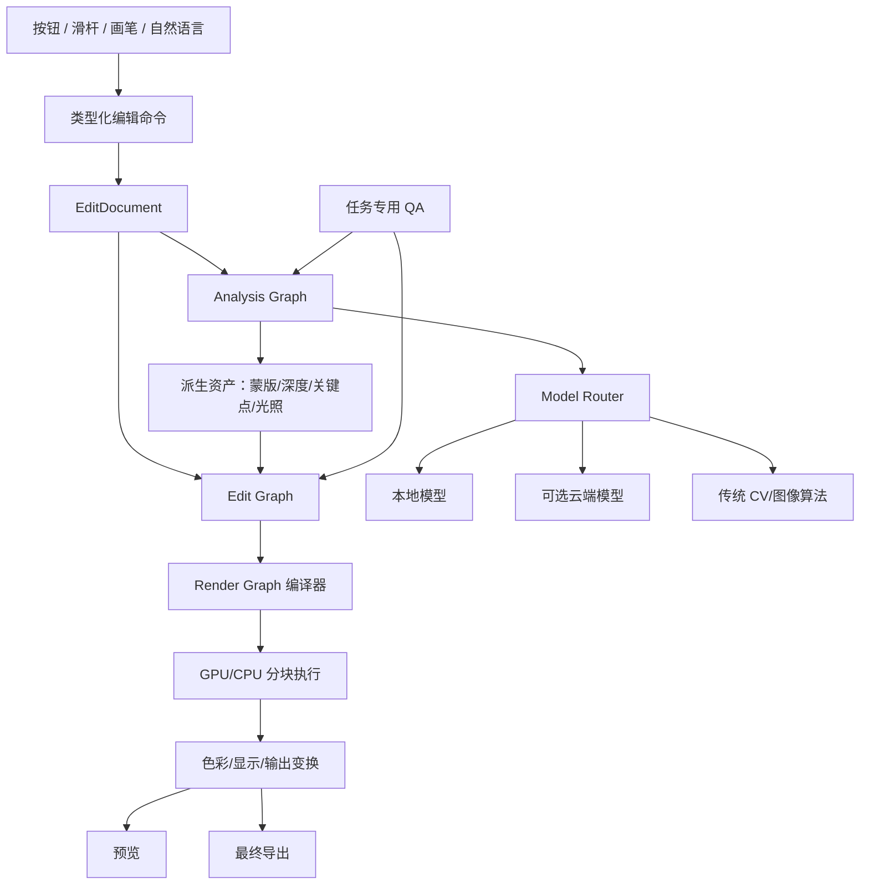

# AI 与图像处理架构

## 1. 核心边界

> AI 负责理解、建议、蒙版和候选；编辑文档负责表达用户意图；专业渲染与色彩引擎负责最终像素。

这个边界保证更换模型、离线运行或打开旧工程时，核心编辑能力仍然稳定。

## 2. 总体分层



分析图不改像素；编辑图保存意图；渲染图是针对设备和质量档临时编译的执行计划。

## 3. 场景理解资产

### 3.1 统一场景图

场景图包含：

- 人物、脸、身体、宠物、天空、建筑、植被、水体、地面等实例；
- 稳定实例 ID；
- 深度、遮挡顺序、地平线、消失点；
- 主光方向、色温、阴影和反射候选；
- 材质与边缘类型；
- OCR 文字、标志等保护区域；
- 每项置信度和来源。

用户手工修订存为覆盖层，重新分析不得覆盖人工结果。

### 3.2 蒙版

`MaskAsset` 使用浮点 Alpha，并记录：

- 语义类别/实例 ID；
- 坐标空间和转换矩阵；
- 模型、版本、源节点哈希；
- 置信度图和边缘不确定度；
- 羽化、膨胀、收缩；
- 用户增选、减选和保护画笔。

支持布尔组合，如：

```text
(人物 AND 皮肤) AND NOT (眼睛 OR 眉毛 OR 嘴唇)
天空 OR 远景
自动目标 + 用户增选 - 用户排除
```

### 3.3 Matting

头发、宠物毛发、头纱、玻璃、树叶、烟雾和运动模糊使用 trimap/Alpha matting，而不是二值分割。边缘模块负责：

- 亚像素 Alpha；
- 前景/背景颜色估计；
- 去背景色污染；
- 边缘类别自适应；
- 用户引导边缘刷；
- 分辨率升级时重建。

### 3.4 深度和几何

深度资产标记相对/公制类型、置信度、遮挡边界、天空无限远和归一方式。人脸资产包含稳定 Face ID、关键点、稠密网格、姿态、可见度和遮挡。

## 4. 模型注册与路由

业务代码引用能力别名，不硬编码模型文件。

```yaml
id: portrait-segmentation-v3
task: semantic-segmentation
version: 3.2.0
runtime: onnx
providers: [directml, coreml, cuda, cpu]
input:
  colorSpace: srgb-display
  preferredSize: [1024, 1024]
output:
  labels: [skin, hair, face, eyes, lips, teeth, clothing]
precision: [fp16, fp32]
estimatedVramMB: 920
privacy: local-only
licenseExpression: Apache-2.0
distributionApproval: approved
sha256: "..."
```

`licenseExpression` 必须使用 SPDX 表达式或经法务登记的
`LicenseRef-*`，不能用“commercial-approved”之类审批状态代替许可证；
审批状态应存放在独立字段中。示例许可证仅用于说明清单格式，不代表未来
人像分割模型的选型或许可结论。

路由条件：

- 任务、质量档和分辨率；
- GPU/CPU、显存和运行时；
- 在线/离线、隐私和地区；
- 延迟/成本上限；
- 模型许可；
- 企业锁定版本；
- 当前图片内容和置信度。

预览可用快速模型，停顿或导出时升级高质量模型；升级只刷新自动派生资产，保留人工增减蒙版。

稳定接口：

- `IAnalyzer`：检测、分割、深度、关键点；
- `IPixelGenerator`：修复、扩图、生成；
- `IImageOperator`：确定性算子；
- `IModelRuntime`：ONNX/平台运行时；
- `IModelProvider`：本地、企业、云端；
- `IQualityEvaluator`：任务专用 QA。

## 5. AI 颜色适配

大多数视觉模型在显示参考 sRGB 上训练，但主编辑在高位深宽色域中进行。每次模型调用经过 `ModelColorAdapter`：

1. 从工作空间生成 tone-mapped 分析代理；
2. 保存裁剪、缩放、方向和色彩转换；
3. 几何输出映射回文档坐标；
4. 像素输出转换回工作空间；
5. 匹配曝光、白平衡、噪点、颗粒与锐度；
6. 原图高光和 RAW 信息不被代理图覆盖。

模型不能自行决定工作色彩空间。

## 6. 人像管线

```text
人物/人脸检测
→ 稳定 Face ID 与姿态
→ 皮肤/五官/头发/衣物分割
→ 临时瑕疵候选
→ 频率感知肤质
→ 局部明暗与肤色
→ 受约束五官形变
→ 身份/纹理/背景 QA
→ 可编辑节点和蒙版
```

### 6.1 磨皮

- 大尺度：曝光、阴影和高光；
- 中尺度：色斑、红斑、眼袋和起伏；
- 小尺度：毛孔、细汗毛和纹理。

算法优先修改大/中尺度，保留小尺度和关键边缘。可组合引导滤波、频域分解、局部曲线与学习型残差，但结果必须输出可调强度和保护蒙版。

### 6.2 五官

稠密形变场带以下正则：

- 位移按脸宽、瞳距或眼裂宽归一；
- 局部面积和角度变化上限；
- 虹膜近圆、眼睑遮挡和双眼会聚约束；
- 唇线、脸颊、法令纹联动；
- 背景、发际线、眼镜和首饰冻结；
- 多人实例隔离。

身份相似度只用于变化告警，不用作身份识别或跨用户追踪。

## 7. 风景管线

```text
RAW/镜头
→ 场景分割与深度
→ 地平线/透视
→ 动态范围恢复
→ 分区去雾与局部对比
→ 天空/植被/水面/建筑颜色
→ 噪点与锐化
→ 光晕/色域/结构 QA
```

去雾和局部对比使用边缘、深度和天空保护，避免山脊黑白边。雪地、霓虹、落日和夜景分别使用内容规则，不能以全局饱和度替代场景调整。

## 8. 宠物管线

宠物模型输出眼、鼻、耳、嘴、身体、爪、长/短毛 Alpha、项圈和牵引绳。毛发锐化沿方向场工作并抑制白边；泪痕与毛色调整保持毛向和品种标记。人宠合影使用两套语义区域和各自保护规则。

## 9. 换天空管线

```text
天空分割 / Matting
→ 地平线、焦距感、太阳方向
→ 候选天空检索
→ 几何与曝光匹配
→ 前景环境光与方向光候选
→ 反射候选
→ 去色边、景深、噪点
→ 边缘、光向、色温 QA
```

天空资源元数据决定初始匹配；前景重光照、反射和天空像素始终是独立节点。结构复杂或置信度低时进入辅助蒙版。

## 10. 对象移除管线

1. 实例分割并扩展到阴影/反射；
2. 分析结构线、平面、重复纹理、深度和文字；
3. 选择邻域修复、PatchMatch、透视引导或生成式策略；
4. 先恢复结构和遮挡边界；
5. 再恢复阴影与反射；
6. 多源融合纹理；
7. 匹配噪点、锐度和颜色；
8. 生成多个候选；
9. 检测重复纹理、断线、接缝、模糊和语义异常。

生成式修复使用“全图低分辨率上下文 + 高分辨率重叠块”，不能把大图独立切块后无上下文生成。用户锁定区域不再被重试覆盖。

## 11. 生成式结果

节点保存：

- 输入区域和必要上下文；
- 提示、结构化约束与负约束；
- 提供方、模型、版本、采样参数和种子；
- 候选及用户选择；
- 最终补丁和 Alpha；
- 色彩/噪点匹配参数；
- 生成范围与来源记录。

用户可“冻结结果”，使模型下线后旧工程仍能打开。只有提示词而没有补丁的工程不满足稳定性要求。

## 12. 本地/云端策略

默认本地：

- 检测、分类、分割、matting、深度；
- 人像分析和基础磨皮；
- 传统修复与纹理合成；
- 质量检查。

可选云端：

- 大面积复杂生成式修复；
- 高质量扩图和语义生成；
- 本地模型不能满足的候选。

云端只上传必要 ROI 与上下文；首次和策略变化时显示范围、提供方、目的、保留期和本地替代。完全离线模式是一级产品功能。

## 13. GPU 与分块

统一 `ComputeBackend` 屏蔽 DirectML/Vulkan/CUDA/Metal/Core ML/CPU。上层算子声明精度与内存，不直接调用厂商 API。

分块原则：

- 256–1024 px 可配置瓦片；
- 卷积、模糊和去噪带 halo；
- ROI 失效只重算相关瓦片；
- 代理图、交互、最终三档质量；
- 100MP 不要求整图驻留显存；
- 最终模式提供可复现路径。

显存不足降级顺序：缩小分析 batch → 减少驻留瓦片 → 卸载闲置模型 → CPU/轻量模型 → 提示用户。不会损坏文档或降低最终输出而不告知。

## 14. 任务专用 QA

### 人像

- 纹理频谱与边缘保留；
- 五官形变幅度和背景弯曲；
- 眼睛、牙齿、发际线异常；
- 肤色分块与过度白化；
- 身份变化告警。

### 换天/抠图

- 边界和半透明 Alpha；
- 前景污染、地平线接缝；
- 景深、噪点和锐度一致；
- 光向、色温和反射合理性。

### 移除

- 直线、透视和重复结构；
- 重复纹理、接缝和模糊斑；
- 文字/标志变形；
- 新增异常人物、肢体或物体；
- 补丁颗粒和色彩不匹配。

低置信度结果降低默认强度、给多个候选、显示热区并进入异常队列。无人值守批处理不应用 R3 结果。

## 15. 模型失败

- 模型缺失：使用能力兼容模型或经典算法；
- 推理失败：回滚当前临时任务，不提交半结果；
- 输出格式错误：模型契约验证失败并隔离版本；
- 结果 QA 失败：保留候选但不推荐；
- 云端断线：取消/排队/本地降级由用户选择；
- 模型更新退化：按模型别名回滚到已知良好版本。
