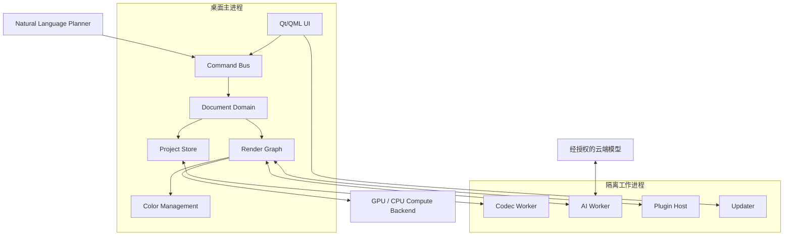

# 系统架构

## 1. 架构驱动因素

系统设计按以下顺序优化：

1. 原图、项目和颜色正确性；
2. 可撤销、可恢复、可复现；
3. 24–100MP 图片的交互性能；
4. AI 模型可替换与本地优先；
5. 快捷、专业、批处理和自然语言共用同一内核；
6. 不可信图片、模型和插件的隔离；
7. Windows/macOS 一致能力与合理降级。

## 2. 总体架构



## 3. 推荐技术方案

当前建议（需由技术尖峰最终接受）：

| 层 | 建议 |
|---|---|
| 桌面 UI | Qt 6 + QML，原生窗口、无障碍、压感笔和多显示器 |
| 核心语言 | C++23；严格 RAII、sanitizer、静态分析和边界封装 |
| 构建 | CMake + Ninja；依赖锁定与可复现构建 |
| 图像/RAW | LibRaw 或 RawSpeed 抽象层；OpenImageIO 类编解码抽象 |
| 色彩 | OpenColorIO + LittleCMS，应用自有颜色域声明 |
| GPU | 自有 `ComputeBackend`；首批验证 D3D12/Metal/Vulkan 或 Dawn/WebGPU |
| AI | ONNX Runtime + DirectML/Core ML/CUDA/CPU 提供器；云端走独立 Provider |
| 存储 | SQLite WAL + 内容寻址对象存储 + Zstandard |
| IPC | Protobuf 或有版本的二进制协议；公共契约同时发布 JSON Schema |
| 插件 | WASM/WASI 优先，原生扩展必须在隔离进程 |
| 测试 | Catch2/GoogleTest、Qt Quick Test、CTest、金图/差分/模糊测试 |
| 模型工具 | Python 仅用于训练、转换和离线评测，不进入主应用关键路径 |

不把具体第三方库写进工程格式。编解码、颜色、GPU、模型运行时均有应用自有接口，便于许可、兼容或质量原因下替换。

## 4. 进程边界

### 4.1 主进程

包含 UI、命令总线、不可变文档快照、历史、渲染调度与项目事务。主进程不直接解析未知压缩文件，也不加载第三方原生插件。

### 4.2 Codec Worker

- 解析图片、RAW、项目包和缩略图；
- 限制 CPU、内存、像素总量、解压比例和递归深度；
- 返回规范化像素块和元数据；
- 崩溃或超时不影响项目；
- 导出先写临时目标，校验后原子替换新文件。

### 4.3 AI Worker

- 加载本地模型并维护显存预算；
- 接受标准张量、蒙版与能力请求；
- 不持有可写项目句柄；
- 输出派生资产和 QA，不直接提交命令；
- 云端 Provider 只接收命令授权范围内的数据；
- 可按模型或任务重启。

### 4.4 Plugin Host

- WASM 或隔离原生进程；
- 权限默认拒绝；
- 每次任务获得短期像素/文件/GPU 句柄；
- 插件崩溃、死循环和内存超限可被终止；
- 不直接访问项目数据库和应用密钥。

### 4.5 Updater

更新器与主应用分离，验证签名、渠道、版本防回滚和包哈希；支持安全回退到上一已知良好版本。

## 5. 模块边界

| 模块 | 职责 | 禁止 |
|---|---|---|
| `document` | 图层、节点、蒙版引用、版本和选择状态 | 网络、GPU、任意文件 IO |
| `commands` | Schema、权限、事务、撤销/重做、并发版本 | 执行未注册动作 |
| `render` | DAG 编译、脏区、瓦片、缓存、质量档 | 修改文档 |
| `imaging` | 像素算子、采样、卷积、几何与混合 | 感知 UI |
| `color` | ICC、工作/显示/输出变换、软打样 | 隐式丢弃配置 |
| `selection` | 选区、画笔、Alpha、边缘精修 | 保存业务工作流 |
| `project_store` | 事务、对象、快照、迁移、恢复 | 解释编辑语义 |
| `ai` | 模型注册、路由、推理、QA、降级 | 提交文档变化 |
| `language` | 意图、引用、计划、风险校验 | 任意脚本/网络/文件 |
| `plugin_runtime` | 清单、权限、隔离、配额 | 默认系统权限 |
| `desktop` | 展示状态、采集输入、构造命令 | 绕过命令总线 |

强制依赖规则：

```text
UI / Language / Plugin
          ↓
      Command Bus
          ↓
    Document Domain
      ↙         ↘
Project Store  Render Graph
                   ↓
          Imaging / Color / AI
```

渲染缓存可全部删除；删除后不能改变最终结果。

## 6. 线程与调度

主进程至少包含：

- UI 线程：只做交互与轻量状态；
- 文档线程：串行提交事务，发布不可变快照；
- 渲染调度池：计算脏区和瓦片；
- GPU 提交线程：拥有设备和资源池；
- IO 池：项目、缓存和导出；
- IPC 线程：工作进程事件。

优先级：

1. 当前画布交互和笔刷；
2. 当前视口停顿后的精确预览；
3. 用户等待的 AI 候选；
4. 自动保存；
5. 后台导出；
6. 预设缩略图和未打开照片分析。

长任务必须可取消；取消令牌贯穿命令、模型、渲染和 IPC。GPU 内核无法中断时可以完成当前 dispatch，但不得继续排队或提交结果。

## 7. 渲染与显示

渲染器接收不可变 `DocumentSnapshot`：

1. 按节点版本编译 DAG；
2. 消除无效节点并融合兼容算子；
3. 将更改传播到受影响 ROI；
4. 建立带 halo 的瓦片任务；
5. 分配 CPU/GPU 和精度；
6. 生成场景线性结果；
7. 应用 view transform 与显示器 ICC；
8. 发布带修订号的画布纹理。

UI 只显示与当前文档修订匹配的帧。旧任务晚到时丢弃，避免参数已变化却闪回旧图。

质量档：

- `draft`：拖动期间，允许代理图和已批准近似；
- `interactive`：停顿后完整逻辑、视口优先；
- `final`：原尺寸、最高精度、完整 QA。

## 8. 能力探测与降级

启动时生成 `DeviceProfile`：

- CPU 架构、核心和 SIMD；
- 系统/显存预算；
- GPU 后端与驱动；
- 支持的纹理格式和精度；
- AI execution provider；
- HDR 显示和 ICC；
- 磁盘空间与缓存状态。

功能请求通过能力系统选择路径，不能散落硬件判断。降级过程写入结果说明：

```text
高质量人像模型需要更多显存；已切换到分块 FP16。
最终输出质量不变，预计时间从 8 秒增加到 19 秒。
```

## 9. 外部服务

云端 AI、资产库和可选审片服务均通过 Provider 接口：

- 服务商与地区可替换；
- OAuth/密钥由系统安全存储管理；
- 请求声明允许的图像区域、分辨率、用途、费用上限和保留策略；
- 核心工程可以完全离线打开、编辑和导出；
- 云资产必须冻结到项目或给出明确缺失状态。

## 10. 可观测性

本地结构化事件只记录：

- 操作类型、匿名错误码；
- 图片尺寸/位深/颜色空间类别；
- 模块与模型版本；
- 耗时、内存/显存、降级路径；
- QA 分数和是否撤销。

默认不记录像素、完整路径、文件名、人脸关键点、提示原文或云端凭据。调试包生成前显示清单并二次脱敏。

## 11. 关键故障行为

| 故障 | 行为 |
|---|---|
| GPU 设备丢失 | 暂停提交，重建资源；必要时 CPU 预览；项目不受影响 |
| AI Worker 崩溃 | 临时任务失败，可重启；已提交节点仍可用冻结资产 |
| Codec Worker 崩溃 | 标记输入失败并隔离文件；主进程继续 |
| 磁盘满 | 停止新持久化，保持内存文档，提示释放空间/另存 |
| 自动保存失败 | 持续醒目标识，不谎报“已保存” |
| 项目迁移失败 | 打开备份或只读旧版，不覆盖旧项目 |
| 插件异常 | 终止插件任务、撤销临时分支、可安全模式禁用 |
| 云端中断 | 取消、排队或本地降级；不产生半完成事务 |

## 12. 技术尖峰

编码前必须用同一张 45MP、16 位测试图验证：

1. Qt 画布与选定 GPU 后端的纹理共享；
2. 线性宽色域、显示 ICC 和 16 位 TIFF 往返；
3. 512px 瓦片 + halo 的曲线、模糊和蒙版；
4. 画笔 20ms 反馈；
5. ONNX 模型在三类 Windows GPU 与 Apple Silicon 的路由；
6. SQLite WAL + 对象存储在强制终止后的恢复；
7. Codec Worker 和 AI Worker 的 IPC 吞吐；
8. 100MP 低显存分块而不整图驻留。

若 Qt/GPU 互操作或跨平台后端不能达到预算，应更换 UI/渲染桥，不改变命令、项目和插件契约。
