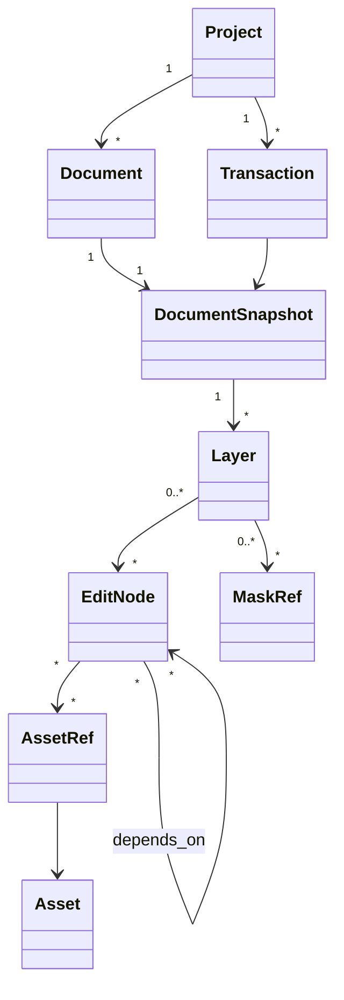

# 编辑文档与项目格式

## 1. 设计目标

- 原图不可变；
- 快捷和专业模式像素等价；
- 任意自动步骤可以局部修改或禁用；
- 预览与正式提交分离；
- 异常退出只丢失未确认预览；
- 大文件不要求整图驻留内存或显存；
- 模型下线后旧工程仍可稳定打开；
- 格式可迁移、可检查、可修复。

## 2. 领域模型



主要实体：

- `Project`：格式版本、工作空间、资源策略和文档集合；
- `DocumentSnapshot`：特定修订号下的不可变状态；
- `Layer`：图层树、可见性、不透明度、混合、变换、蒙版；
- `EditNode`：类型、Schema 版本、参数、输入、ROI 和确定性信息；
- `MaskAsset`：Alpha、来源、置信度、人工覆盖和坐标；
- `Asset`：源图、像素补丁、深度、代理、LUT 等；
- `Subject`：项目内人物/宠物/天空等稳定引用；
- `Transaction`：命令批次、前后修订、来源和警告；
- `PresetRecipe`：可参数化的节点片段。

## 3. 图层视图与编辑 DAG

用户看到图层树；底层保存有向无环编辑图。一个图层可以映射多个节点，一个节点可以复用蒙版或上游结果。

```text
Layer: 人像精修组
├─ Node: blemish.repair
├─ Node: skin.tone_even
├─ Node: skin.texture_smooth
├─ Node: local.dodge_burn
└─ Mask: person-1/skin - protected-features
```

规则：

- DAG 必须无环；
- 节点输入、参数和输出域显式声明；
- 节点版本参与缓存键；
- 节点不能读取未声明的 UI 或全局状态；
- 生成式节点引用冻结补丁；
- 渲染图可以优化，但不能改写文档语义。

## 4. 节点最小结构

```json
{
  "nodeId": "node_01J...",
  "type": "portrait.skin_retouch",
  "schemaVersion": 3,
  "enabled": true,
  "inputs": ["node_raw_develop"],
  "masks": ["mask_person1_skin"],
  "parameters": {
    "blemishRemoval": 0.55,
    "skinSmooth": 0.24,
    "texturePreservation": 0.90
  },
  "computeDomain": "scene-linear",
  "roiPolicy": "mask-bounds-plus-halo",
  "implementation": {
    "algorithmVersion": "2.1.0",
    "modelAlias": "portrait-retouch-balanced",
    "resolvedModelVersion": "2.4.1",
    "seed": 183704
  }
}
```

确定性传统节点保存算法版本；生成式节点额外保存补丁、Alpha、候选、提供方和来源。

## 5. 坐标与像素约定

必须显式区分：

- 传感器 RAW 坐标；
- EXIF 定向后的源坐标；
- 图层本地坐标；
- 文档画布坐标；
- 视口/屏幕坐标；
- 模型输入归一坐标。

每个蒙版、画笔和几何资产记录坐标空间与转换矩阵。约定像素中心、边界采样、通道顺序、预乘 Alpha 和矩阵乘法顺序，不能由实现猜测。

建议内部：

- 场景参考线性宽色域；
- GPU 中间结果 FP16；
- 颜色关键参考与最终 CPU 路径 FP32；
- 预乘 Alpha；
- 节点明确 `scene-linear`、`display-referred`、`log` 或 `perceptual` 计算域。

最终默认工作空间需通过颜色 ADR 和实测确定。

## 6. 项目存储

工作项目是逻辑目录包：

```text
example.npsproj/
├─ project.db              # SQLite：文档、节点、事务、迁移
├─ objects/                # 内容哈希：源、蒙版块、生成补丁
├─ previews/               # 可删除代理和缩略图
├─ recovery/               # 未压缩恢复日志
├─ manifests/              # 模型/插件/资产依赖快照
└─ project.lock
```

分享时导出为 ZIP64 类单文件 `example.nps`：

- 包含 manifest、对象校验和和大小上限；
- 可选择嵌入原图或保留外链；
- 解包在低权限 Worker 中完成；
- 拒绝路径穿越、符号链接逃逸、压缩炸弹和未知主版本；
- 解包失败不影响原包。

## 7. 内容寻址对象

大型资产先写临时文件，校验哈希，再原子重命名并提交引用。对象按内容去重。

资产类型：

- 原始/嵌入源；
- RAW 代理和金字塔；
- 蒙版与深度瓦片；
- 生成式候选和冻结补丁；
- 自定义天空、纹理、LUT；
- 局部修复层；
- 导出中间文件（不进入项目真相）。

`previews/` 和渲染缓存不属于项目真相，可重建。对象垃圾回收只删除不被任何快照、版本分支或事务引用的内容，并先进入可恢复待删队列。

## 8. 外链与便携模式

### 外链

- 保存经用户授权的文件句柄、相对路径提示和内容哈希；
- 文件移动后用哈希、文件名和用户选择重新链接；
- 源发生变化时不静默接受，显示版本冲突；
- 项目本身不写入原始源。

### 便携

- 把源复制到对象仓库；
- 可选项目加密；
- 打包前估算空间；
- 默认去除临时缓存；
- 共享时提示项目可能包含人像与位置数据。

## 9. 事务、预览和撤销

### 9.1 正式事务

所有永久修改通过命令总线，以 `expectedRevision` 做乐观并发控制：

1. 校验命令、权限和前置条件；
2. 建立新不可变快照；
3. 写入新对象并校验；
4. SQLite 事务提交引用、历史和新修订；
5. 发布 `revisionCommitted`；
6. 渲染新快照。

任一步失败则不发布新修订。

### 9.2 临时预览

耗时或高风险操作写入临时分支：

- 不进入正式撤销历史；
- 可多候选切换；
- 来源修订变化后标记过期；
- “应用”提升为一个原子事务；
- “取消”删除可丢弃临时引用。

### 9.3 撤销与分支

撤销移动当前快照指针，不破坏历史对象。用户在旧版本继续编辑时创建分支。分支可命名、比较、合并非冲突节点或导出。

## 10. 自动保存与恢复

- 结构事务使用 SQLite WAL；
- 已提交事务立即持久化轻量日志；
- 大对象采用 write → fsync/校验 → rename → 引用提交；
- 自动保存不得阻塞 UI 超过性能预算；
- 启动时检查未完成对象、WAL、锁和上次干净关闭标志；
- 恢复工具可以列出最近有效修订并只读打开；
- 磁盘满时不谎报保存成功；
- 迁移前备份 `project.db` 和 manifest。

恢复目标：已提交事务 100% 保留，最多丢失当前未应用预览。

## 11. 缓存与失效

缓存键至少包含：

- 源资产哈希；
- 节点类型、版本和规范化参数；
- 上游内容哈希；
- 蒙版修订；
- ROI、分辨率和质量档；
- 工作空间、view transform；
- 设备后端和已批准的精度模式。

调整曝光不会使人脸检测失效；改变裁剪、方向或源像素会使对应坐标资产失效。人工蒙版覆盖层在自动资产刷新后重放。

## 12. 格式版本和迁移

- 容器、数据库和各节点分别有 Schema 版本；
- 同一主版本保持向后兼容；
- 未知可选字段保留，未知关键节点以“冻结像素/只读”打开；
- 迁移是可重入、可测试的显式程序；
- 迁移失败保留旧文件并提供只读打开；
- 发布前运行跨版本往返和历史项目语料库；
- 不保证新版本保存的项目能由任意旧版本编辑，但可提供兼容副本导出。

## 13. 导出

导出是项目快照的只读任务：

- 锁定目标修订、分支和输出配方；
- 使用 `final` 渲染；
- 运行颜色、尺寸、Alpha 和元数据校验；
- 写入临时文件；
- 重新读取关键元数据和尺寸；
- 原子移动到目标；
- 同名默认版本化，不覆盖源文件。

导出失败不修改项目修订，也不留下被误认为成品的半文件。
