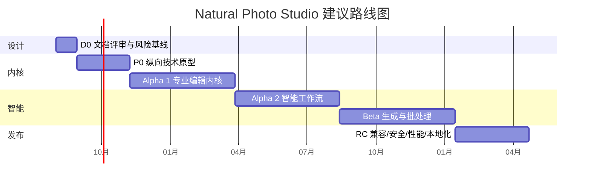

# 实施路线图

## 1. 现实范围

“Photoshop 级专业水准”包含颜色、格式、稳定性、性能、图层/蒙版、生态和几十年兼容积累，不应被解释为几个月内复制全部 Photoshop。

本路线图的 1.0 定义为：

> 在人物、风景、宠物、换天、对象移除、预设、RAW、非破坏图层、色彩和批量照片工作流上达到可用于商业交付的质量；不追求首版覆盖高级矢量、视频、3D 和完整排版。

建议 10–14 人核心团队，18–24 个月完成聚焦型 1.0。3–5 人团队若保持同一质量门槛，应按 30–48 个月或显著收缩范围规划。

## 2. 阶段总览



日期只是从 2026 年 8 月启动的示例；实际以人员到位和退出条件为准。阶段可以部分重叠，但项目格式、色彩和命令协议是关键路径。

## 3. D0：设计与风险基线（3–4 周）

范围：

- 评审本目录全部设计；
- 接受或修订四份 ADR；
- 确认目标平台、最低硬件和产品范围；
- 选择内部颜色工作空间候选；
- 确认第三方库与模型许可；
- 建立命令、项目、模型和插件 Schema 样例；
- 建立 30–50 张许可明确的技术基准小集。

退出条件：

- P0 需求均有验收；
- 术语和 ID 无冲突；
- 原图、云端和外貌修改默认值获得确认；
- 技术尖峰清单、人员和预算批准；
- 无未决问题会改变持久化格式或安全边界。

## 4. P0：纵向技术原型（8–10 周）

目标不是漂亮 UI，而是贯通：

```text
导入 24/45MP 图
→ RAW/JPEG 代理
→ 非破坏曝光/曲线
→ 画笔蒙版
→ GPU 分块预览
→ 撤销/重做
→ 保存、强制终止、恢复、重开
→ 16 位 TIFF/JPEG 导出
```

再加入：

- 一个本地人物/天空分割模型；
- 一个受限自然语言例子：“人物亮一点，背景不动”；
- Codec Worker 与 AI Worker；
- 显存不足分块；
- 基础 ICC 显示路径。

退出条件：

- 原图不写；
- 1000 次命令/撤销/重做哈希正确；
- 强制终止后已提交事务恢复；
- 45MP 目标硬件性能方向可达；
- CPU/GPU 结果在初步颜色预算内；
- 所有永久修改经过命令总线；
- 架构没有需要推翻项目/命令格式的问题。

## 5. Alpha 1：专业编辑内核（4–5 个月）

功能：

- 图层、组、蒙版、选区、画笔；
- 裁剪、拉直、透视和变换；
- 曝光、白平衡、曲线、色阶、HSL、色彩平衡；
- 修复/仿制基础；
- RAW、镜头配置、噪点和锐化基础；
- 8/16 位、ICC、SDR 软打样；
- 项目分支、自动保存、重链和后台导出；
- 快捷/专业模式共享文档；
- JPEG/PNG/TIFF/一批 RAW 格式。

同时建设：

- CPU 参考算子；
- 金图和跨 GPU 差分；
- 颜色实验室；
- 恶意文件 Fuzz；
- 安装、崩溃和项目恢复。

退出条件：

- Alpha 1 范围金图、颜色和项目恢复通过；
- 24MP 基础交互性能达标；
- 8 小时长稳无持续泄漏；
- 支持格式不会破坏元数据；
- 项目可从上一内部版本迁移。

## 6. Alpha 2：智能工作流（4–5 个月）

功能：

- 场景图、主体/人物/皮肤/头发/宠物/天空分析；
- 一键人物、风景、宠物；
- 瑕疵、纹理保护磨皮；
- 五官轻度自动和手动网格；
- 主体/毛发/头发 Matting；
- 内容感知预设与当前图缩略预览；
- 自然语言计划、目标引用、程度/否定词和连续对话；
- 本地模型注册、路由、签名和 QA。

退出条件：

- 自动结果都能展开为节点和蒙版；
- 身份、纹理和非目标人物保护达到门槛；
- 自然语言高风险漏确认为零；
- 离线、低显存和模型缺失降级完整；
- 人像/宠物数据覆盖与许可审查通过；
- 真实修图师完成端到端可用性测试。

## 7. Beta：生成、换天、移除和批量（5–6 个月）

功能：

- 天空库、自有天空、前景重光照和反射；
- 结构感知对象/路人移除；
- 大面积可选云端生成式补全；
- 背景替换、接触阴影与合成 QA；
- 降噪、超分辨率和老照片修复；
- 批量样片、内容感知同步和异常队列；
- 预设包、导出配方；
- WASM 插件 SDK 初版；
- 可选云 Provider、配额与隐私 UI；
- PSD 分层兼容的第一阶段。

退出条件：

- 换天和移除视觉门槛达标；
- 低置信度进入异常队列；
- 批量不会把人物/蒙版机械复制；
- 云端最小化上传与删除流程验证；
- 插件隔离审计通过；
- Beta 无崩溃会话率 ≥99.8%。

## 8. RC：发布候选（3–4 个月）

- 冻结 1.0 项目格式、命令和 SDK 主版本；
- 完成 Windows/macOS 支持矩阵；
- HDR/CMYK/软打样范围按测试结果定版；
- 性能调优、驱动黑名单和设备降级；
- 无障碍、中文/英文、本地化布局；
- 安装、更新、回滚、离线安装；
- 完整故障注入、Fuzz、长稳和安全审计；
- 旧项目迁移语料库；
- 用户帮助、教程、隐私说明和支持工具；
- 分阶段发布与紧急暂停。

退出条件：

- 未解决 P0/P1 缺陷为零；
- 未解决严重/高危安全问题为零；
- Stable 可靠性目标在候选群达到；
- 性能预算达到或有少量、明确、有期限的硬件豁免；
- 所有模型、素材、字体和依赖许可完整；
- 回滚应用与模型版本均验证。

## 9. 1.0 之后

### 1.x

- HDR、全景、焦点堆栈增强；
- PSD/PSB 兼容扩展；
- 高级印刷和工作室色彩；
- 动作录制、CLI 和团队预设；
- 插件生态与签名市场；
- 现场联机导入；
- 内容凭证。

### 2.x / 多年方向

- 更广泛的矢量、文字与版式；
- 联机审片与团队协作；
- 企业资产管理和私有模型；
- 多设备工作流；
- 专业第三方硬件控制。

## 10. 团队建议

| 角色 | Alpha | Beta/RC |
|---|---:|---:|
| 产品负责人 | 1 | 1 |
| UX/视觉/无障碍 | 1–2 | 2 |
| 图像/颜色/渲染工程 | 3 | 3–4 |
| 桌面客户端 | 2 | 2–3 |
| AI/计算机视觉 | 2–3 | 3–4 |
| 平台/安全/构建 | 1–2 | 2 |
| QA/自动化 | 1–2 | 2–3 |
| 专业修图顾问 | 兼职 1–2 | 持续 2–4 |
| 法务/隐私/许可 | 按门禁参与 | 按门禁参与 |

关键岗位是颜色/图像内核、AI 视觉质量和项目恢复；不能全部由通用应用开发替代。

## 11. 优先级约束

如果时间或预算不足，按以下顺序减范围：

1. 延后在线协作、市场和第三方生态；
2. 延后高级版式、完整 PSD 和 CMYK；
3. 缩小 RAW 相机/平台矩阵；
4. 缩小生成式范围；
5. 缩小一键配方数量。

不得用以下方式“赶进度”：

- 覆盖原图；
- 取消项目恢复；
- 使用 8 位 sRGB 作为唯一内核；
- 让自然语言绕过命令；
- 未授权上传；
- 把一键结果烘焙成不可修改黑盒；
- 取消视觉 QA。

## 12. 风险登记

| 风险 | 概率/影响 | 领先指标 | 缓解 |
|---|---|---|---|
| 范围接近完整 Photoshop | 高/高 | 里程碑跨期、P0 增长 | 聚焦照片工作流，变更委员会 |
| 跨 GPU 颜色/渲染不一致 | 中/高 | 差分趋势升高 | CPU 参考、后端认证、驱动策略 |
| AI 塑料感/身份变化 | 中/高 | 大量调弱/撤销 | 保守默认、纹理/身份 QA、盲评 |
| 高分辨率显存耗尽 | 高/高 | OOM/降级率 | 代理、瓦片、预算器、Worker |
| RAW/ICC 复杂度 | 高/高 | 新格式回归 | 独立颜色测试、有限支持矩阵 |
| 语言选错目标 | 中/高 | 用户纠正和撤销 | 可视计划、稳定 ID、消歧 |
| 项目迁移损坏 | 低/极高 | 恢复/迁移失败 | 备份、语料库、只读打开 |
| 插件供应链 | 中/极高 | 越权/签名异常 | 沙箱、默认拒绝、吊销 |
| 云成本/隐私失控 | 中/高 | 拒绝率、上传量 | 本地优先、ROI、费用上限 |
| 模型/素材许可不清 | 中/高 | 未知 license | 构建门禁、法务清单 |

## 13. 每阶段评审

每个阶段结束回答：

- 原图、颜色、项目和隐私是否仍然正确？
- 一键结果能否被专业工具接管？
- 失败是否可见、可恢复和可降级？
- 新模型/插件是否可被替换而不破坏工程？
- 性能是 P95 数据还是单次演示？
- 困难样例是否被诚实纳入报告？
