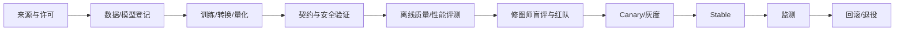

# 模型与数据治理

## 1. 目标

模型治理要保证每个进入产品的模型：

- 来源和商业许可明确；
- 输入、输出、颜色、坐标和运行时契约明确；
- 在目标人群、场景和硬件上完成评测；
- 不依赖未经同意的用户数据；
- 可灰度、可固定、可回滚；
- 失败时有传统算法、手动工具或旧模型；
- 生成结果可追踪。

## 2. 模型生命周期



任一阶段缺少证据则不能进入下一阶段。

## 3. 模型 Manifest

必填：

- 稳定 ID、语义版本、任务；
- 文件哈希、签名、大小；
- 来源、作者、许可证和商用状态；
- 训练/转换工具链摘要；
- 输入尺寸、通道、范围、颜色空间和归一化；
- 输出张量、标签、坐标、Alpha/置信度语义；
- 支持运行时、硬件、精度和预计 RAM/VRAM；
- 本地/云端、地区和数据策略；
- 兼容的操作/节点版本；
- 已通过的评测集与门槛；
- 已知限制和禁止用法；
- 回滚替代版本。

## 4. 模型卡

每个能力别名至少一份模型卡：

```text
用途与非用途
模型与来源
数据概况和许可
输入/输出契约
性能和资源
分场景质量
人群/设备分层结果
已知失败
隐私与安全
版本变更
批准人和日期
```

“效果看起来不错”不是模型卡。

## 5. 数据来源

允许：

- 明确商业授权的数据集；
- 自有拍摄且模特/宠物主人授权用途；
- 合成或程序生成数据；
- 公共领域或许可兼容数据；
- 专门签署评测/研究同意的封闭集。

禁止：

- 默认收集用户项目、云请求或崩溃附件训练；
- 来源/人物同意不清的抓取人像；
- 把测试集混入训练；
- 用受限客户项目作为演示或回归样本；
- 通过人脸嵌入把不同客户项目关联；
- 去除水印后作为训练素材。

每项数据记录来源、许可、地域、人物同意、用途、访问、保留和删除要求。

## 6. 数据集结构

分离：

- 训练；
- 验证；
- 开发金标；
- 冻结测试；
- 困难/红队；
- 性能；
- 真实工作流盲评。

同一人物、同一连拍、同一场景和同一素材衍生物必须落在同一分区，避免泄漏。冻结测试集只允许评测服务读取，研发不能反复针对性调参。

## 7. 覆盖要求

人像：

- 多种肤色、年龄、性别表达；
- 正/侧脸、遮挡、眼镜、头纱、首饰；
- 妆容、无妆、油光、雀斑、痣、疤痕、皱纹；
- 日光、棚拍、逆光、夜景和高 ISO；
- 单人、多人、儿童和老人。

宠物：

- 猫狗为首批，长/短、黑/白/花色；
- 胡须、运动、遮挡、项圈、牵引绳；
- 多宠物和人宠合影。

风景/修复：

- 树枝、电线、建筑、道路、栏杆、砖墙；
- 水面/玻璃反射、阴影、雾、雪、夜景；
- 简单至大面积遮挡；
- 文字和标志保护。

## 8. 标注质量

- 标注指南版本化；
- 关键边缘提供软 Alpha，不只二值多边形；
- 人像“临时瑕疵/永久特征”由专业人员和授权说明支持；
- 双标 + 仲裁用于关键测试集；
- 记录不确定性，不强迫单一答案；
- 定期抽样重标并测量一致性；
- 自动伪标签不能作为冻结金标。

## 9. 评测

### 契约

- 张量、颜色、坐标、NaN/Inf；
- 极端尺寸、空目标、多人/无脸；
- 不同执行 Provider；
- 内存、超时、取消和确定性。

### 质量

- 分割 IoU + 边界/Alpha 指标；
- 人像纹理、几何变化、非目标溢出；
- 换天边缘、光色和景深；
- 修复重复纹理、结构、接缝；
- 宠物毛发/胡须；
- 人类盲评自然度、可用性和偏好。

### 分层报告

按内容难度、肤色/年龄、光照、设备和模型精度分层。总体平均不能掩盖某个重要分组的明显退化。

## 10. 人像公平与身份保护

- 各人群分别报告漏检、误修改和自然度；
- 默认强度不以肤色明度错误推断“需要美白”；
- 不把年龄、肤色、脸型或身体特征作为缺陷标签；
- 身份变化检测只在本地本项目内，不存长期模板；
- 若某分组表现明显较差，降低自动化、显示辅助蒙版或暂不支持；
- 产品文案避免审美歧视。

## 11. 隐私和访问

- 人像数据集加密、最小权限和访问审计；
- 训练环境与产品遥测分离；
- 导出样本需审批和水印/去标识；
- 删除请求传播到副本、标注和派生集；
- 生产用户数据进入训练需要单独、明确、可撤销的选择加入机制；
- 企业/客户素材永不因一般产品条款自动加入。

## 12. 模型发布

步骤：

1. manifest/签名/许可；
2. 契约、恶意输入和资源测试；
3. 冻结集和旧版本对比；
4. 专业修图师盲评；
5. 本地小规模 canary；
6. Beta 灰度；
7. Stable；
8. 持续监测撤销、降级、失败和资源。

模型更新与应用更新使用同等质量门禁。能力别名先指向 canary，稳定后逐步扩展；企业可固定版本。

## 13. 回滚和退役

触发：

- 自然度/身份/边缘明显退化；
- 崩溃、显存或性能异常；
- 许可变化；
- 安全漏洞或签名异常；
- 云端数据策略变化；
- 某硬件 Provider 输出异常。

动作：

- 别名回退到已知良好；
- 禁止新下载；
- 已安装包隔离；
- 保留旧工程所需冻结结果；
- 发布迁移或重新分析选择；
- 记录事故和防复发测试。

退役不能让旧项目静默改变外观。

## 14. 生成式来源

每个生成节点保存：

- 服务/模型/版本；
- 输入和输出区域；
- 结构化提示、约束和种子；
- 候选与选择；
- 冻结补丁哈希；
- 时间和授权策略；
- 内容来源/凭证字段。

提供方不能返回可验证来源时，仍要明确标记“AI 生成/补全”，不能表示为真实被遮挡内容。

## 15. 治理角色

- 产品：用途、默认值和用户说明；
- AI：模型契约、评测和失败分析；
- 影像专家：自然度和商业可用性；
- 隐私/法务：数据、许可和地区；
- 安全：模型供应链和运行时；
- 发布负责人：灰度、监测和回滚。

模型上线至少需要 AI、影像和安全/许可三方批准。
